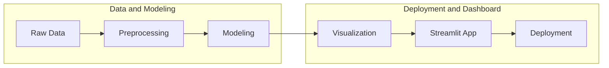

# 🌍 ESG & Financial Performance Dashboard

This project utilizes a dataset from Kaggle titled "ESG & Financial Performance Dataset". This dataset contains the financial and ESG (Environmental, Social, and Governance) performance of 1,000 global companies in 9 industries and 7 regions from 2015 to 2025. The dataset includes realistic financial metrics (e.g., revenue, profit margin, market capitalization) along with comprehensive ESG indicators, including carbon emissions, resource usage, and detailed ESG scores. You can access the complete documentation for this dataset [here](https://www.kaggle.com/datasets/shriyashjagtap/esg-and-financial-performance-dataset).

## 🔄 Project Workflow

## ⚓ Tools Used
- Pandas
- Numpy
- Streamlit
- Plotly
- Pipeline
- GridSearchCV
- RandomForest (Predicting)
- K-Means (Clustering)

## 🚨 Live App
Click [this](https://shopping-trend-dashboard.streamlit.app/) to watch the live app on streamlit.io.

## Future Improvements
- Developing segmentation and prediction features on the app

## 📲 Contact
Please feel free to contact me if you have any questions or feedback:
- **Email**: [My Email](muhamadsalimalwan10@gmail.com)
- **LinkedIn**: [My LinkedIn](https://www.linkedin.com/in/muhamad-salim-alwan/)
- **GitHub**: [My GitHub](https://github.com/salim23-png)
- **Instagram**: [My Instagram](https://www.instagram.com/salim.cloud)
- **Medium**: [My Medium](https://medium.com/@muhamadsalimalwan10)
- **Kaggle**: [My Kaggle](https://www.kaggle.com/muhamadsalimalwan)

---

Thank you for checking out this project! I hope you find it insightful😇
