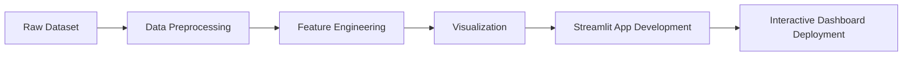

# 🛒Shopping Trend Dashboard

The dataset used is sourced from Kaggle, titled "Customer Shopping Trends Dataset", which can be accessed via [this link](https://www.kaggle.com/datasets/iamsouravbanerjee/customer-shopping-trends-dataset). The dataset contains various information about consumer behavior and purchasing patterns, including information about consumer age and gender, store location, purchasing season, payment type, delivery type, and so on.

## 🔄 Project Workflow

Feature Information

| No | Feature Name             | Data Type | Description                                                                                       |
|----|---------------------------|------------|---------------------------------------------------------------------------------------------------|
| 1  | Customer ID               | int64      | Unique identifier for each customer                                                              |
| 2  | Age                       | int64      | Age of the customer                                                                               |
| 3  | Gender                    | object     | Gender of the customer (Male/Female)                                                              |
| 4  | Item Purchased            | object     | The item purchased by the customer                                                                |
| 5  | Category                  | object     | Category of the item purchased                                                                    |
| 6  | Purchase Amount (USD)     | int64      | The amount of the purchase in USD                                                                 |
| 7  | Location                  | object     | Location where the purchase was made                                                              |
| 8  | Size                      | object     | Size of the purchased item                                                                        |
| 9  | Color                     | object     | Color of the purchased item                                                                       |
| 10 | Season                    | object     | Season during which the purchase was made                                                         |
| 11 | Review Rating             | float64    | Rating given by the customer for the purchased item                                               |
| 12 | Subscription Status       | object     | Indicates if the customer has a subscription (Yes/No)                                             |
| 13 | Shipping Type             | object     | Type of shipping chosen by the customer                                                           |
| 14 | Discount Applied          | object     | Indicates if a discount was applied to the purchase (Yes/No)                                      |
| 15 | Promo Code Used           | object     | Indicates if a promo code was used for the purchase (Yes/No)                                      |
| 16 | Previous Purchases        | int64      | Total count of past transactions by the customer (excluding the current one)                      |
| 17 | Payment Method            | object     | Customer’s most preferred payment method                                                          |
| 18 | Frequency of Purchases    | object     | Frequency at which the customer makes purchases (e.g., Weekly, Fortnightly, Monthly)              |

